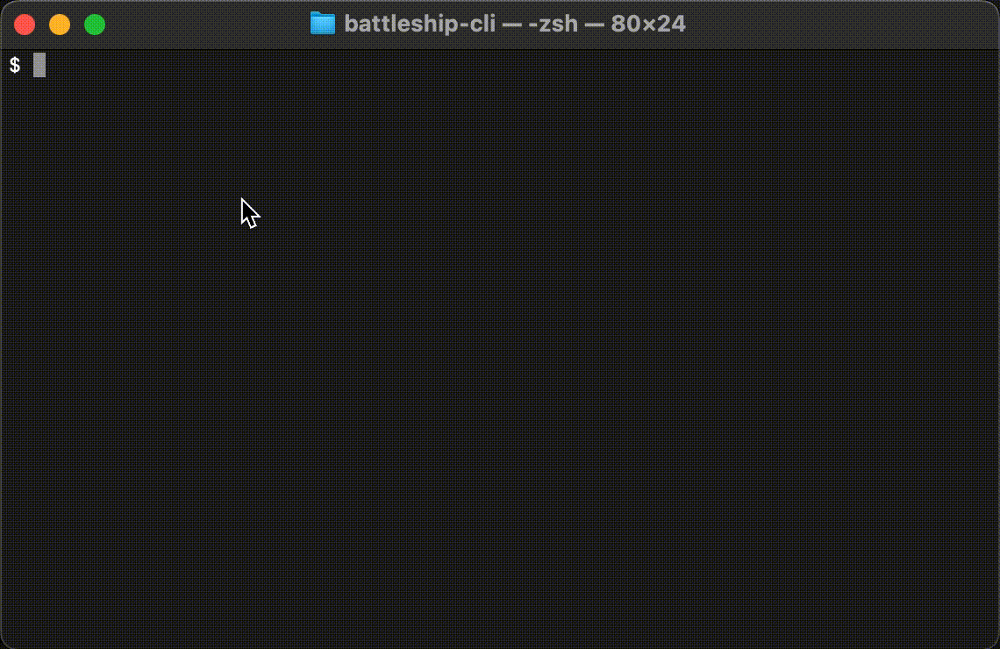

# battleship-cli

Battleship game played in terminal



## Installation

Clone the repository

Install dependencies

```bash
  npm install
```

Run the game

```bash
  node battleship-cli
```

## How to play

Default ships:

- 5 squares: 1
- 4 squares: 1
- 3 squares: 2
- 2 squares: 3

The ship number and sizes can be changed using `--ships` argument. Example: `--ships 3 3 2` means two 3-square ship and one 2-square ship.

Enter your move in the form `<Letter><Number>`, e.g. `a2` or `A2`.

To interrupt the game type `exit`.

## Optimizations

- Add difficulty levels
- Set width and height of the board
